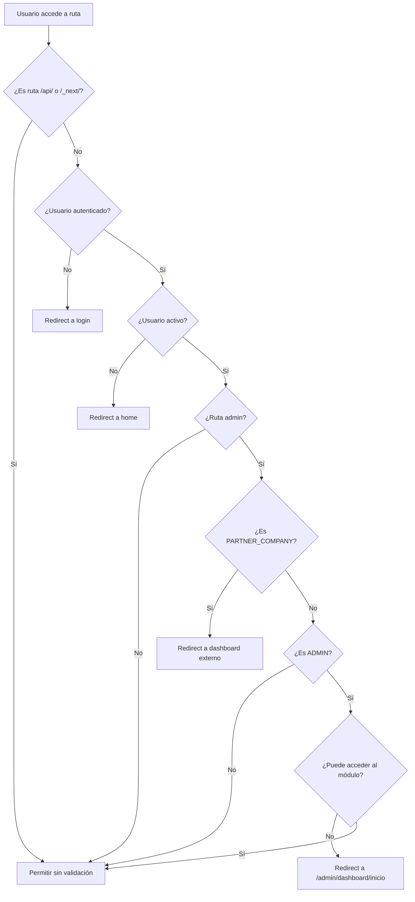

# Sistema de Acceso y Permisos - OTC

## 🎯 Descripción General

El sistema OTC implementa un control de acceso granular basado en **roles** y **módulos permitidos**. Este sistema permite controlar tanto qué funcionalidades puede usar un usuario como qué secciones puede ver en la navegación.

## 🏗️ Arquitectura del Sistema

### Componentes Principales

1. **Roles de Usuario**: Definen permisos de CRUD sobre entidades
2. **Módulos Permitidos**: Controlan qué secciones puede ver un usuario
3. **Roles de Acceso**: Distinguen entre administradores y empresas externas
4. **Áreas Documentales**: Controlan acceso a documentos específicos

## 👥 Roles de Usuario

### Roles Principales

```typescript
// Roles básicos
USER_ROLE.admin              // Administrador completo
USER_ROLE.user               // Solo lectura
USER_ROLE.readOnlyViewer     // Visualizador limitado

// Roles especializados
USER_ROLE.workOrderOperator        // Órdenes de trabajo
USER_ROLE.workPermitOperator       // Permisos de trabajo  
USER_ROLE.safetyTalkOperator       // Charlas de seguridad
USER_ROLE.startupFolderOperator    // Carpetas de arranque
USER_ROLE.laborControlOperator     // Control laboral
USER_ROLE.maintenancePlanOperator  // Planes de mantenimiento
USER_ROLE.documentationOperator    // Documentación
USER_ROLE.equipmentOperator        // Equipos
USER_ROLE.companyOperator          // Empresas
USER_ROLE.userOperator            // Usuarios
```

### Permisos por Rol

**Administrador (`admin`)**:
- ✅ Acceso completo a todo el sistema
- ✅ Crear, editar, eliminar en todos los módulos
- ✅ Gestionar usuarios y empresas
- ✅ Acceso a reportes y estadísticas

**Operadores Especializados**:
- ✅ CRUD completo en su módulo específico
- ✅ Lectura en otros módulos relacionados
- ❌ Sin acceso a gestión de usuarios

**Solo Lectura (`user`, `readOnlyViewer`)**:
- ✅ Solo visualización de datos
- ❌ Sin permisos de edición

## 🧩 Módulos del Sistema

### Módulos Disponibles

```typescript
MODULES.ALL                    // Acceso completo a todos los módulos
MODULES.WORK_ORDERS           // Órdenes de Trabajo y Libros de Obra
MODULES.WORK_PERMITS          // Permisos de Trabajo
MODULES.SAFETY_TALK           // Charlas de Seguridad
MODULES.STARTUP_FOLDERS       // Carpetas de Arranque
MODULES.LABOR_CONTROL_FOLDERS // Control Laboral
MODULES.DOCUMENTATION         // Biblioteca Documental
MODULES.EQUIPMENT             // Equipos y Ubicaciones
MODULES.MAINTENANCE_PLANS     // Planes de Mantenimiento
MODULES.COMPANY               // Gestión de Empresas
MODULES.USERS                 // Gestión de Usuarios
MODULES.WORK_REQUESTS         // Solicitudes de Trabajo
MODULES.LOCKOUT_PERMITS       // Permisos de Bloqueo
MODULES.VEHICLES              // Vehículos de Contratistas
```

### Módulos Especiales (Navegación)

```typescript
"HOME"           // Página de inicio
"REPORTABILITY"  // Reportes y estadísticas  
"NOTIFICATIONS"  // Centro de notificaciones
"TOOLS"          // Herramientas administrativas
"TUTORIALS"      // Centro de ayuda
```

## 🔐 Roles de Acceso

### ACCESS_ROLE.ADMIN
- **Ubicación**: Rutas `/admin/dashboard/*`
- **Características**: 
  - Acceso completo al panel administrativo
  - Sujeto a filtros de módulos permitidos
  - Puede gestionar otros usuarios
  - Acceso a reportabilidad y herramientas

### ACCESS_ROLE.PARTNER_COMPANY  
- **Ubicación**: Rutas `/dashboard/*`
- **Características**:
  - Acceso limitado a funciones de su empresa
  - **Sin restricciones de módulos** (ven todo)
  - No pueden gestionar usuarios de OTC
  - Centrado en operaciones de campo

## 🎛️ Sistema de Módulos Permitidos

### Funcionamiento

El sistema de módulos **solo aplica para administradores** (`ACCESS_ROLE.ADMIN`):

```typescript
// Para Administradores (/admin/dashboard/*)
if (user.accessRole === "ADMIN") {
    // Se filtran módulos según allowedModules
    if (!userModules.includes(targetModule)) {
        // Redirect según mejor ruta disponible
    }
}

// Para Empresas Externas (/dashboard/*)
if (user.accessRole === "PARTNER_COMPANY") {
    // Sin restricciones - acceso completo
}
```

### Rutas Siempre Accesibles (Administradores)

Para administradores, estas rutas **siempre** están disponibles:

- `/admin/dashboard/inicio` - **Página principal (siempre accesible)**
- `/admin/dashboard/mi-cuenta/*` - Información personal

### Sistema de Redirección Inteligente

El sistema incluye una función que determina la mejor ruta de redirección basándose en los módulos permitidos:

```typescript
// Orden de prioridad para redirección
1. HOME → /admin/dashboard/inicio
2. WORK_ORDERS → /admin/dashboard/ordenes-de-trabajo
3. WORK_PERMITS → /admin/dashboard/permisos-de-trabajo  
4. SAFETY_TALK → /admin/dashboard/charlas-de-seguridad
5. STARTUP_FOLDERS → /admin/dashboard/carpetas-de-arranques
6. LABOR_CONTROL_FOLDERS → /admin/dashboard/control-laboral
7. ... otros módulos
```

## 📋 Configuración Práctica

### Crear Usuario Administrador Completo

```sql
INSERT INTO "User" (
    "id", "name", "email", "rut", 
    "role", "accessRole", "allowedModules"
) VALUES (
    'admin_001', 'Juan Pérez', 'admin@otc.cl', '12345678-9',
    'admin', 'ADMIN', '{ALL}'
);
```

### Crear Usuario Especializado

```sql
-- Supervisor de Seguridad (solo charlas y permisos)
INSERT INTO "User" (
    "id", "name", "email", "rut",
    "role", "accessRole", "allowedModules"
) VALUES (
    'safety_001', 'María González', 'seguridad@otc.cl', '98765432-1',
    'safetyTalkOperator', 'ADMIN', '{SAFETY_TALK,WORK_PERMITS}'
);
```

### Crear Usuario Solo con Módulos Específicos (sin HOME)

```sql
-- Usuario que solo maneja órdenes de trabajo (sin acceso a inicio)
INSERT INTO "User" (
    "id", "name", "email", "rut",
    "role", "accessRole", "allowedModules"
) VALUES (
    'operator_001', 'Pedro Martínez', 'operador@otc.cl', '55555555-5',
    'workOrderOperator', 'ADMIN', '{WORK_ORDERS}'
);
-- Este usuario será redirigido automáticamente a /admin/dashboard/ordenes-de-trabajo
```

### Crear Usuario Empresa Externa

```sql
-- Usuario de empresa contratista (sin restricciones de módulos)
INSERT INTO "User" (
    "id", "name", "email", "rut", "companyId",
    "role", "accessRole", "allowedModules"
) VALUES (
    'contractor_001', 'Pedro Silva', 'pedro@contratista.cl', '11111111-1', 'company_123',
    'user', 'PARTNER_COMPANY', '{ALL}'
);
```

## 🔄 Flujo de Validación

### Middleware de Acceso (`src/middleware.ts`)



### Validación de Sidebar (`navMain.tsx`)

```typescript
// Filtrar elementos del sidebar solo para admins
const isAdmin = canAccessAdminRoutes
const filteredNavData = navData
    .map(group => ({
        ...group,
        items: filterAdminSidebarItems(group.items, userModules, isAdmin)
    }))
    .filter(group => group.items.length > 0)
```

## 🚨 Resolución de Problemas Comunes

### Problema: Usuario sin módulo HOME no puede acceder después del login

**Causa**: El usuario fue redirigido a `/admin/dashboard/inicio` pero no tiene el módulo HOME permitido.

**Solución Aplicada**:
- ✅ La ruta `/admin/dashboard/inicio` es siempre accesible independientemente de los módulos
- ✅ Sistema de redirección inteligente dirige al primer módulo disponible

### Problema: Usuario creado sin allowedModules

**Solución**:
```sql
-- Dar acceso completo a usuario sin módulos
UPDATE "User" SET "allowedModules" = '{ALL}' WHERE "allowedModules" IS NULL;
```

### Problema: Usuario no puede ver ningún elemento en sidebar

**Causa**: No tiene módulos permitidos o módulos incorrectos.

**Solución**:
```sql
-- Verificar módulos del usuario
SELECT "allowedModules" FROM "User" WHERE "id" = 'user_id';

-- Agregar módulos básicos
UPDATE "User" SET 
    "allowedModules" = '{WORK_ORDERS,WORK_PERMITS,SAFETY_TALK}'
WHERE "id" = 'user_id';
```

## 🔧 Archivos Clave del Sistema

### Validación y Permisos
- `src/middleware.ts` - Middleware principal de autenticación
- `src/lib/module-permissions.ts` - Lógica de validación de módulos
- `src/lib/get-user-redirect.ts` - Redirección inteligente
- `src/lib/permissions.ts` - Definición de roles y permisos

### Componentes de UI
- `src/shared/components/sidebar/navMain.tsx` - Navegación filtrada
- `src/shared/components/sidebar/appSidebar.tsx` - Sidebar principal

### Formularios y Gestión
- `src/project/user/components/forms/InternalUser.tsx` - Formulario de usuarios
- `src/project/user/actions/updateUser.ts` - Actualización de usuarios
- `src/project/user/columns/user-columns.tsx` - Tabla de usuarios

### Constantes y Configuración
- `src/lib/consts/modules.ts` - Definición de módulos y etiquetas
- `src/lib/consts/areas.ts` - Áreas documentales
- `src/project/user/schemas/internalUser.schema.ts` - Validación Zod

## 🎉 Funcionalidades Implementadas

### ✅ Control Granular por Módulos
- Administradores pueden tener acceso limitado a módulos específicos
- Empresas externas ven todo sin restricciones
- Página de inicio siempre accesible para administradores

### ✅ Redirección Inteligente  
- Después del login, redirige al mejor módulo disponible
- Prioriza HOME, luego otros módulos por importancia
- Fallback seguro a inicio siempre disponible

### ✅ Interfaz de Gestión
- Multi-selector de módulos en formulario de usuario
- Columna visual en tabla de usuarios mostrando módulos asignados
- Validaciones Zod para asegurar integridad de datos

### ✅ Navegación Dinámica
- Sidebar se filtra automáticamente según módulos del usuario
- Solo administradores ven elementos filtrados
- Empresas externas ven navegación completa

### ✅ Seguridad Integral
- Validación en middleware (servidor)
- Validación en componentes (cliente)  
- Rutas críticas siempre protegidas
- Logs de actividad para auditoría

## 🚀 Casos de Uso Típicos

### Caso 1: Usuario Visualizador de Seguridad
```sql
-- Solo puede ver charlas de seguridad y permisos de trabajo
UPDATE "User" SET 
    "allowedModules" = '{SAFETY_TALK,WORK_PERMITS}',
    "role" = 'readOnlyViewer'
WHERE "id" = 'safety_viewer';
```
**Resultado**: Será redirigido a `/admin/dashboard/charlas-de-seguridad` después del login.

### Caso 2: Supervisor de Control Laboral
```sql
-- Solo maneja control laboral y carpetas de arranque
UPDATE "User" SET 
    "allowedModules" = '{LABOR_CONTROL_FOLDERS,STARTUP_FOLDERS}',
    "role" = 'laborControlOperator'
WHERE "id" = 'labor_supervisor';
```  
**Resultado**: Será redirigido a `/admin/dashboard/carpetas-de-arranques` (primer módulo disponible).

### Caso 3: Usuario Solo con Órdenes de Trabajo
```sql
-- Usuario que solo maneja órdenes de trabajo
UPDATE "User" SET 
    "allowedModules" = '{WORK_ORDERS}',
    "role" = 'workOrderOperator'
WHERE "id" = 'work_operator';
```
**Resultado**: Será redirigido directamente a `/admin/dashboard/ordenes-de-trabajo`.

## 📝 Notas Importantes

1. **La página de inicio (`/admin/dashboard/inicio`) es siempre accesible** para administradores, independientemente del módulo HOME.

2. **Los usuarios externos (`PARTNER_COMPANY`) no tienen restricciones de módulos** y ven toda la navegación disponible para su rol.

3. **El sistema prioriza la experiencia del usuario** redirigiendo automáticamente al módulo más relevante disponible.

4. **Todos los cambios son inmediatos** pero requieren que el usuario vuelva a hacer login para ver los cambios en la navegación.

5. **El sistema es escalable** y permite agregar nuevos módulos fácilmente actualizando las constantes y mapeos de rutas.
