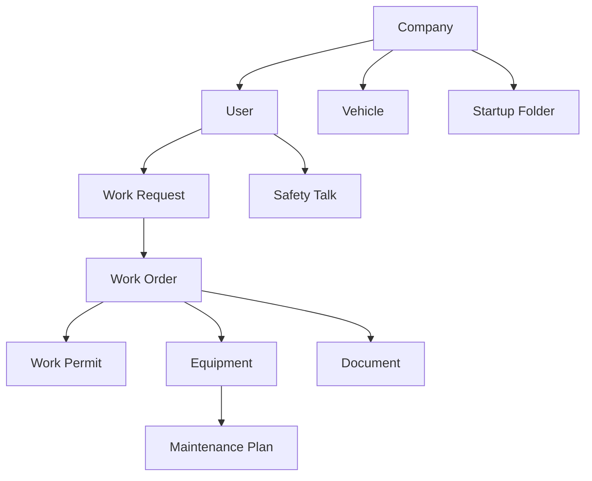

# Módulos del Sistema IS 360

## 🏗️ Arquitectura Modular

El sistema IS 360 está organizado en módulos independientes y cohesivos, cada uno con su propia responsabilidad y funcionalidad específica. Esta arquitectura modular facilita el mantenimiento, escalabilidad y desarrollo de nuevas características.

### Estructura de Módulos

Cada módulo sigue una estructura estándar:

## 📋 Módulos Principales

### 🔧 Work Order (Órdenes de Trabajo)

**Ubicación:** `/src/project/work-order/`

#### Funcionalidades

- ✅ Creación y gestión de órdenes de trabajo
- ✅ Seguimiento de progreso y milestones
- ✅ Gestión de libros de obra
- ✅ Aprobación y cierre de órdenes
- ✅ Inspecciones IS 360
- ✅ Actividades diarias y adicionales
- ✅ Generación automática de números OT
- ✅ Notificaciones por email

#### Componentes Principales

```typescript
// Schemas de validación
workOrderSchema: {
  type: WORK_ORDER_TYPE,
  priority: WORK_ORDER_PRIORITY,
  solicitationDate: Date,
  workDescription: string,
  estimatedHours: number,
  estimatedDays: number,
  equipment: string[],
  companyId: string,
  responsibleId: string
}
```

#### Actions Disponibles

- `createWorkOrder`: Crear nueva orden de trabajo
- `updateWorkOrder`: Actualizar orden existente
- `approveClosure`: Aprobar cierre de orden
- `rejectClosure`: Rechazar cierre de orden
- `requestClosure`: Solicitar cierre de orden
- `createActivity`: Crear actividad en orden
- `generateOTNumber`: Generar número único de OT

#### Hooks Personalizados

- `use-work-order`: Gestión de órdenes individuales
- `use-work-books`: Lista de libros de obra
- `use-work-order-stats`: Estadísticas de órdenes
- `use-work-order-filters`: Filtros avanzados

### 🛡️ Work Permit (Permisos de Trabajo)

**Ubicación:** `/src/project/work-permit/`

#### Funcionalidades

- ✅ Creación de permisos de trabajo
- ✅ Gestión de tipos de trabajo (caliente, espacios confinados, altura, eléctrico)
- ✅ Evaluación de riesgos
- ✅ Asignación de participantes
- ✅ Vinculación con órdenes de trabajo
- ✅ Seguimiento de vehículos asociados
- ✅ Aprobación por oficial de prevención

#### Tipos de Permisos

```typescript
enum WORK_PERMIT_TYPE {
  HOT_WORK, // Trabajo en caliente
  CONFINED_SPACE, // Espacios confinados
  HEIGHT_WORK, // Trabajo en altura
  ELECTRICAL, // Trabajo eléctrico
  EXCAVATION, // Excavación
  CRANE_OPERATION, // Operación de grúas
}
```

#### Estados del Permiso

```typescript
enum WORK_PERMIT_STATUS {
  PENDING, // Pendiente
  APPROVED, // Aprobado
  IN_PROGRESS, // En progreso
  COMPLETED, // Completado
  CANCELLED, // Cancelado
  EXPIRED, // Expirado
}
```

### 🏢 Company (Gestión de Empresas)

**Ubicación:** `/src/project/company/`

#### Funcionalidades

- ✅ Registro de empresas contratistas
- ✅ Gestión de supervisores
- ✅ Configuración de carpetas de arranque
- ✅ Registro de vehículos de empresa
- ✅ Validación de RUT empresarial
- ✅ Gestión de documentos corporativos

#### Schema de Empresa

```typescript
companySchema: {
  name: string,
  rut: string,
  startupFolderType: StartupFolderType,
  vehicles: Vehicle[],
  supervisors: Supervisor[]
}
```

### 🔧 Equipment (Gestión de Equipos)

**Ubicación:** `/src/project/equipment/`

#### Funcionalidades

- ✅ Registro de equipos industriales
- ✅ Jerarquía de equipos (padre-hijo)
- ✅ Códigos de barras y tags únicos
- ✅ Clasificación por criticidad
- ✅ Gestión de ubicaciones
- ✅ Historial de mantenimiento
- ✅ Imágenes de equipos

#### Niveles de Criticidad

```typescript
enum CRITICALITY {
  LOW, // Baja
  MEDIUM, // Media
  HIGH, // Alta
  CRITICAL, // Crítica
}
```

### 🛠️ Maintenance Plan (Planes de Mantenimiento)

**Ubicación:** `/src/project/maintenance-plan/`

#### Funcionalidades

- ✅ Creación de planes de mantenimiento preventivo
- ✅ Programación de tareas recurrentes
- ✅ Asignación de frecuencias (diaria, semanal, mensual, anual)
- ✅ Generación automática de órdenes de trabajo
- ✅ Seguimiento de cumplimiento
- ✅ Alertas de vencimiento

#### Frecuencias Disponibles

```typescript
enum PLAN_FREQUENCY {
  DAILY, // Diaria
  WEEKLY, // Semanal
  MONTHLY, // Mensual
  QUARTERLY, // Trimestral
  BIANNUAL, // Semestral
  ANNUAL, // Anual
}
```

### 🎓 Safety Talk (Charlas de Seguridad)

**Ubicación:** `/src/project/safety-talk/`

#### Funcionalidades

- ✅ Programación de charlas de seguridad
- ✅ Registro de asistencia
- ✅ Contenido multimedia (videos, documentos)
- ✅ Evaluaciones y certificaciones
- ✅ Charlas para visitantes
- ✅ Mapas interactivos de seguridad
- ✅ Seguimiento de cumplimiento

#### Tipos de Charlas

- Charlas generales de seguridad
- Charlas específicas por área
- Charlas para visitantes
- Charlas de emergencia
- Charlas de equipos específicos

### 👥 User (Gestión de Usuarios)

**Ubicación:** `/src/project/user/`

#### Funcionalidades

- ✅ Registro de usuarios del sistema
- ✅ Gestión de roles y permisos
- ✅ Asignación de módulos por usuario
- ✅ Usuarios internos y externos
- ✅ Supervisores de empresa
- ✅ Autenticación de dos factores
- ✅ Gestión de sesiones

#### Roles de Usuario

```typescript
enum USER_ROLE {
  ADMIN, // Administrador del sistema
  USER, // Usuario estándar
  PARTNER_COMPANY, // Empresa contratista
  SUPERVISOR, // Supervisor de empresa
  OPERATOR, // Operador de campo
}
```

### 📁 Document (Gestión Documental)

**Ubicación:** `/src/project/document/`

#### Funcionalidades

- ✅ Subida y almacenamiento de documentos
- ✅ Categorización por áreas
- ✅ Control de versiones
- ✅ Permisos de acceso por área
- ✅ Búsqueda avanzada de documentos
- ✅ Integración con Azure Blob Storage
- ✅ Previsualización de documentos

#### Áreas Documentales

```typescript
enum AREAS {
  OPERATIONS,
  INSTRUCTIONS,
  INTEGRITY_AND_MAINTENANCE,
  ENVIRONMENT,
  OPERATIONAL_SAFETY,
  QUALITY_AND_OPERATIONAL_EXCELLENCE,
  REGULATORY_COMPLIANCE,
  LEGAL,
  COMMUNITIES,
  PROJECTS,
  PURCHASING,
  ADMINISTRATION_AND_FINANCES,
  IT,
  GERENCY,
  DOCUMENTARY_LIBRARY,
}
```

### 🚗 Vehicle (Gestión de Vehículos)

**Ubicación:** `/src/project/vehicle/`

#### Funcionalidades

- ✅ Registro de vehículos de contratistas
- ✅ Vinculación con empresas
- ✅ Gestión de permisos de ingreso
- ✅ Seguimiento de vehículos en faena
- ✅ Documentación vehicular
- ✅ Inspecciones de seguridad

#### Tipos de Vehículos

```typescript
enum VEHICLE_TYPE {
  CAR, // Automóvil
  TRUCK, // Camión
  MOTORCYCLE, // Motocicleta
  VAN, // Furgoneta
  BUS, // Bus
  HEAVY_MACHINERY, // Maquinaria pesada
}
```

### 📝 Work Request (Solicitudes de Trabajo)

**Ubicación:** `/src/project/work-request/`

#### Funcionalidades

- ✅ Creación de solicitudes de trabajo
- ✅ Evaluación y aprobación
- ✅ Conversión a órdenes de trabajo
- ✅ Seguimiento de estado
- ✅ Asignación de prioridades
- ✅ Comentarios y observaciones

### 📂 Startup Folder (Carpetas de Arranque)

**Ubicación:** `/src/project/startup-folder/`

#### Funcionalidades

- ✅ Gestión de documentación de arranque
- ✅ Listas de verificación
- ✅ Documentos obligatorios por empresa
- ✅ Seguimiento de cumplimiento
- ✅ Validación de documentos
- ✅ Alertas de vencimiento

## 🔄 Interacciones Entre Módulos

### Flujo Principal de Trabajo

1. **Company** → Registro de empresa contratista
2. **User** → Creación de usuarios y supervisores
3. **Startup Folder** → Validación de documentación
4. **Work Request** → Solicitud de trabajo
5. **Work Order** → Creación de orden de trabajo
6. **Work Permit** → Generación de permisos necesarios
7. **Equipment** → Asignación de equipos
8. **Safety Talk** → Charlas de seguridad obligatorias
9. **Vehicle** → Registro de vehículos para ingreso
10. **Document** → Gestión de documentación del proyecto

### Dependencias Entre Módulos



## 🛠️ Herramientas de Desarrollo

### Schemas de Validación

Cada módulo utiliza Zod para validación de datos:

```typescript
// Ejemplo de schema
export const moduleSchema = z.object({
  field1: z.string().min(1),
  field2: z.number().positive(),
  field3: z.enum(["OPTION1", "OPTION2"]),
})
```

### Server Actions

Acciones del servidor para operaciones de base de datos:

```typescript
"use server"

export const createEntity = async (data: EntitySchema) => {
  // Validación de sesión
  // Validación de permisos
  // Operación de base de datos
  // Logging de actividad
  // Notificaciones
}
```

### Custom Hooks

Hooks personalizados para gestión de estado:

```typescript
export const useEntityList = () => {
  return useQuery({
    queryKey: ["entities"],
    queryFn: fetchEntities,
    staleTime: 5 * 60 * 1000, // 5 minutos
  })
}
```

## 📊 Métricas y Monitoreo

Cada módulo incluye:

- **Logging de actividades**: Registro de todas las operaciones
- **Métricas de rendimiento**: Tiempo de respuesta y uso
- **Alertas automáticas**: Notificaciones de eventos importantes
- **Auditoría**: Seguimiento de cambios y accesos

## 🔒 Seguridad por Módulo

### Control de Acceso

- Validación de permisos por módulo
- Restricciones basadas en roles
- Auditoría de accesos
- Encriptación de datos sensibles

### Validación de Datos

- Schemas estrictos con Zod
- Sanitización de inputs
- Validación en cliente y servidor
- Prevención de inyección SQL

## 🚀 Escalabilidad

### Arquitectura Preparada para Crecimiento

- Módulos independientes
- APIs bien definidas
- Cacheo inteligente
- Optimización de consultas
- Separación de responsabilidades

### Nuevos Módulos

Para agregar un nuevo módulo:

1. Crear estructura de carpetas estándar
2. Definir schemas de validación
3. Implementar server actions
4. Crear componentes React
5. Configurar hooks personalizados
6. Agregar rutas de API
7. Actualizar permisos y roles
8. Documentar funcionalidades
